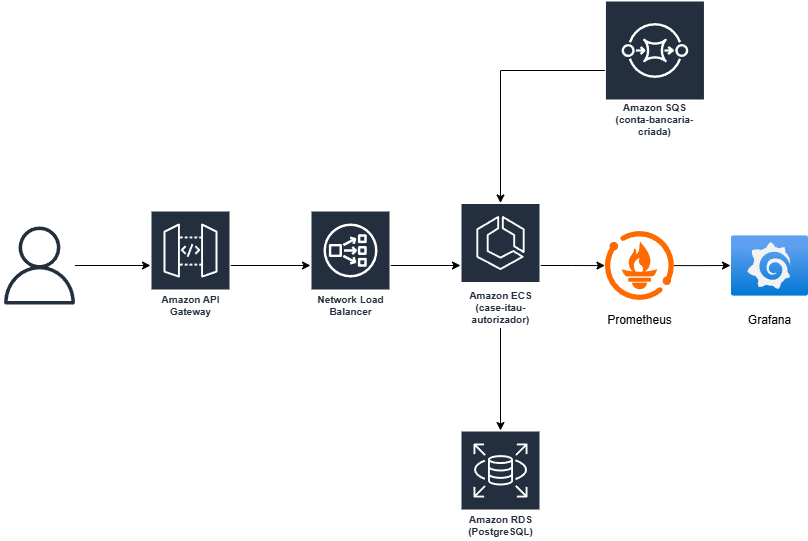

# 🏦 Case Itau Autorizador

Uma aplicação **Spring Boot** responsável por processar mensagens de criação de contas recebidas via **Amazon SQS**, salvar as contas em um **banco de dados PostgreSQL** e disponibilizar endpoints REST para operações de transações (crédito e débito), com métricas expostas para monitoramento via **Prometheus** e **Grafana**.

---

## 📌 Funcionalidades Principais

- ✅ Consumo de mensagens em lote a partir de uma **fila SQS**
- ✅ Fila SQS criada com **RedrivePolicy** com o máximo de 3 tentativas para as mensagens
- ✅ Processamento assíncrono de mensagens utilizando `SqsAsyncClient`
- ✅ Salvamento eficiente em lote das contas no **PostgreSQL**
- ✅ API REST para criação de transações (com controle de concorrência via **Optimistic Locking**)
- ✅ Métricas de performance e contadores expostos via **Micrometer**, **Prometheus** e **Grafana**

---

## 🛠️ Tecnologias Utilizadas

| Tecnologia            | Uso na Aplicação                               | Vantagens                                           |
|-----------------------|-----------------------------------------------|----------------------------------------------------|
| **Spring Boot**       | Framework principal                           | Rápido desenvolvimento e integração com bibliotecas modernas |
| **Spring Data JPA/JDBC** | Persistência no PostgreSQL               | Simplifica acesso a dados e suporta operações em lote |
| **AWS SDK v2 (SQS Async)** | Consumo assíncrono de mensagens da fila | Maior throughput e menor latência                 |
| **PostgreSQL**        | Banco de dados relacional                     | Confiável, suporte a transações e locking otimista |
| **Prometheus + Micrometer** | Métricas e monitoramento              | Coleta de métricas com baixa sobrecarga           |
| **Grafana**           | Dashboard para métricas                       | Visualização rica e customizável                  |
| **Docker Compose**    | Orquestração dos serviços                     | Facilita o setup e execução do ambiente completo  |
| **Testcontainers**    | Testes de integração                          | Permite testes realistas sem infraestrutura externa |

---

## 📂 Arquitetura

- **Consumidor SQS (`SqsBatchConsumer`)** → Recebe mensagens em lote e salva no banco.
- **API REST (`TransactionController`)** → Permite criar transações de crédito/débito.
- **PostgreSQL (RDS em produção)** → Banco para contas e transações.
- **Prometheus + Grafana** → Monitoramento e dashboards.
- **LocalStack** → Emulação de SQS em ambiente local.

---

## ✅ Vantagens da Arquitetura

- ✅ **Escalabilidade** – Containers podem ser replicados conforme demanda
- ✅ **Resiliência** – Uso de fila garante processamento mesmo com falhas temporárias
- ✅ **Observabilidade** – Métricas e logs estruturados facilitam troubleshooting
- ✅ **Facilidade de Teste** – LocalStack e Testcontainers simulam ambiente real sem custos

---

## 🚀 Como Executar Localmente

### 1️⃣ Clonar o Repositório

```bash
git clone https://github.com/lucas-yukioh/case-itau-autorizador.git
cd case-itau-autorizador
```

## 2️⃣ Subir os Serviços

```bash
docker-compose up --build
```

Isso inicializará:

- **LocalStack (SQS)**
- **PostgreSQL** (com tabelas criadas via `init-db`)
- **Prometheus**
- **Grafana**
- **Aplicação Spring Boot** (`case-itau-autorizador`)

---

## 📊 Métricas

- **Prometheus Endpoint:** [http://localhost:8080/actuator/prometheus](http://localhost:8080/actuator/prometheus)
- **Prometheus UI:** [http://localhost:9090](http://localhost:9090)
- **Grafana UI:** [http://localhost:3000](http://localhost:3000)  
  *(usuário: admin / senha: admin)*

### Principais métricas
- ✅ **Transações:** total de sucesso, falhas e taxa por segundo
- ✅ **HTTP Requests:** taxa de requisições por segundo
- ✅ **Banco de Dados:** tempo médio de aquisição de conexão (HikariCP)
- ✅ **Mensagens SQS:** mensagens disponíveis, em processamento e atrasadas
- ✅ **Recursos da JVM/Sistema:** uso de memória e CPU

---

## 🏗️ Deploy na AWS

- **ECS (containers)** para rodar a aplicação de forma escalável
- **Amazon RDS (PostgreSQL)** como banco de dados
- **Amazon SQS** como fila de eventos
- **API Gateway + Network Load Balancer** para expor a API REST
- **Prometheus/Grafana** ou **Amazon Managed Grafana** para dashboards



---

## 🔄 CI/CD Pipeline

### 🔹 1. Build & Unit Test (CI Stage)
- Executar testes unitários (JUnit, Mockito).
- Executar análise estática de código (SonarQube/Checkstyle/SpotBugs).
- Rodar verificação de vulnerabilidades de dependências (OWASP Dependency Check).

### 🔹 2. Integration & Contract Tests
- Utilizar **Testcontainers** para subir localmente PostgreSQL + SQS (LocalStack).
- Validar endpoints da API com **MockMvc** ou **RestAssured**.
- Executar **testes de contrato consumer-driven** caso outros serviços dependam da API.

### 🔹 3. Build Docker Image & Push to ECR
- Gerar imagem versionada (`case-itau-autorizador:1.0.0`).
- Fazer push para o **Amazon ECR (Elastic Container Registry)**.

### 🔹 4. Deploy em Homologação (ECS Fargate)
- Deploy utilizando **AWS CDK/Terraform/CloudFormation**.
- Executar **smoke tests** contra o ambiente de homologação.
- Verificar métricas do Prometheus (ex.: erros, latência).

### 🔹 5. Blue-Green Deployment para Produção

- Manter a versão atual (**blue**) rodando.
- Fazer deploy da nova versão (**green**) no ECS.
- Testar o ambiente **green** → trocar target no API Gateway ou NLB.

### 🔹 6. Post-Deployment Validation
- Realizar **health checks automatizados** (`/actuator/health`).
- Monitorar métricas no Prometheus (taxa de erro, CPU, memória, latência de DB).
- **Rollback automático** caso a taxa de erros aumente significativamente.